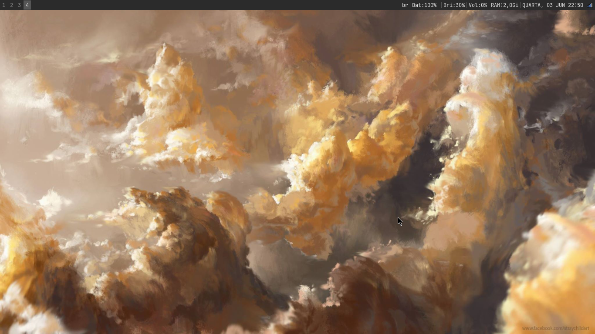
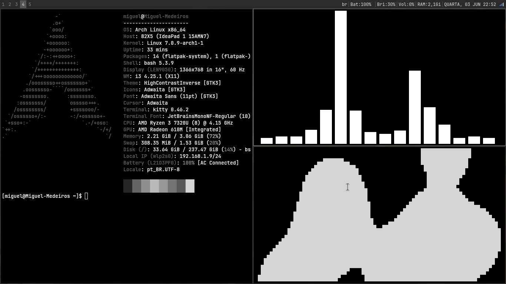

# Arch Linux i3 Dotfiles

Minimal and productivity-focused Arch Linux setup using i3wm.




## Features

- Minimal i3wm workflow
    
- Fast keyboard-driven navigation
    
- i3blocks status bar
    
- Kitty terminal
    
- Picom compositor
    
- Rofi launcher
    
- Cava audio visualizer
    

## Software

|Component|Application|
|---|---|
|WM|i3wm|
|Terminal|Kitty|
|Launcher|Rofi|
|Compositor|Picom|
|Status Bar|i3blocks|
|Audio Visualizer|Cava|

## Installation

Clone the repository:

```bash
git clone git@github.com:MiguelMdrss/arch-i3-dots.git
```

Copy the configuration files:

```bash
cp -r .config ~/
```

Reload i3:

```bash
Mod + Shift + R
```

## Keybindings

| Shortcut | Action           |
| -------- | ---------------- |
| Mod + T  | Open terminal    |
| Mod + D  | Launch Rofi Menu |
| Mod + Z  | Launch Apps Menu |
| Mod + C  | Change Wallpaper |
| Mod + X  | Power Menu       |
| Mod + V  | Clipboard        |
| Mod + N  | Night Light      |
| Mod + Q  | Close Window     |


## Structure

```text
.
├── .config
│   ├── i3
│   ├── i3blocks
│   ├── kitty
│   ├── picom
│   └── cava
└── screenshots
└── .bashrc
```

## License

MIT License